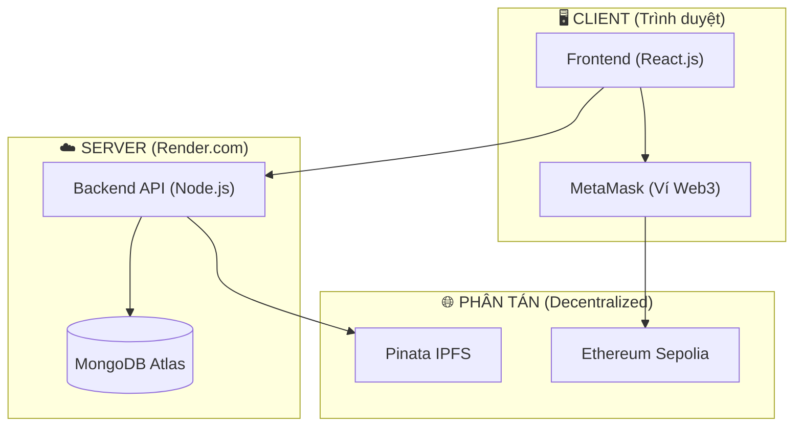

# 🛡️ IE213 - Hệ thống Bảo Hành Điện Tử (E-Warranty) trên Blockchain

Dự án E-Warranty được thiết kế theo mô hình **Hybrid Web3**, kết hợp sức mạnh lưu trữ phi tập trung của Blockchain và hiệu năng tốc độ cao của Web2. Hệ thống sử dụng **React.js** cho Frontend, **Node.js + Express** cho Backend và **Smart Contract (ERC-721)** triển khai trên mạng **Sepolia Testnet**.

---

## ✨ Tính năng nổi bật

- 🛡️ **Bảo mật Hybrid**: Kết hợp JWT (Web2) và Chữ ký số MetaMask (Web3).
- 🖼️ **NFT Warranty**: Mỗi phiếu bảo hành là một token ERC-721 duy nhất, không thể làm giả.
- 📂 **IPFS Storage**: Metadata và ảnh sản phẩm được lưu trữ phi tập trung trên Pinata.
- 🚀 **Hiệu năng cao**: Sử dụng SWR Caching để tải dữ liệu tức thì, giảm tải cho Blockchain.
- 📱 **Giao diện hiện đại**: Thiết kế Responsive, tối ưu cho quản trị viên và người dùng cuối.

---

## 🗺️ Kiến Trúc Hệ Thống (System Overview)

Dự án áp dụng mô hình **Hybrid Web3 Architecture** nhằm tối ưu hóa giữa tính minh bạch của Blockchain và hiệu năng của Web2.

### 🖼️ Sơ đồ Thành phần (Component Diagram)



> [!IMPORTANT]
> **Tài liệu Kiến trúc Chi tiết**: Để xem đầy đủ 7 sơ đồ (Use Case, Sequence, ERD, State Machine, ...), vui lòng truy cập:  
> 👉 **[Tài liệu Kiến trúc Hệ thống (architecture.md)](./docs/architecture.md)**

---

## 📂 Cấu Trúc Thư Mục

Dự án được chia thành các phân hệ độc lập (monorepo structure), mỗi thư mục chứa tài liệu `README.md` riêng để hướng dẫn chi tiết:

| Thư mục | Vai trò | Công nghệ sử dụng |
|---------|---------|-------------------|
| [`/backend`](./backend) | **API Server & Xử lý IPFS**: Đảm nhiệm lưu trữ dữ liệu tập trung, quản lý bảo mật và giao tiếp với Pinata IPFS. | Node.js, Express, MongoDB, Mongoose, Multer. |
| [`/frontend`](./frontend) | **Giao diện Người Dùng**: Quản lý Dashboard Admin, Web3 Integration và caching dữ liệu siêu tốc. | React, Vite, SWR, Ethers.js, Axios. |
| [`/contracts`](./contracts) | **Smart Contract**: Định nghĩa chuẩn ERC-721 cho Warranty NFT. | Solidity, Hardhat, OpenZeppelin. |
| [`/docs`](./docs) | **Tài liệu dự án**: Chứa các báo cáo BA, trạng thái API, tiến độ dự án. | Markdown, Mermaid. |
| [`/tests`](./tests) | **Kiểm thử tự động**: Kịch bản Unit Test và Integration Test. | Jest, Supertest. |

---

## 🚀 Hướng Dẫn Chạy Dự Án (Local Development)

### Yêu Cầu Hệ Thống
- [Node.js](https://nodejs.org/) >= 18.x
- [MongoDB](https://www.mongodb.com/) (Local hoặc Atlas)
- Ví **MetaMask** cài đặt trên trình duyệt (chuyển sang mạng Sepolia).

### 1. Clone Mã Nguồn
```bash
git clone https://github.com/ThanhTris/IE213.git
cd IE213
```

### 2. Cài Đặt Dependencies
```bash
# Cài đặt cho Backend
cd backend && npm install

# Cài đặt cho Frontend
cd ../frontend && npm install
```

### 3. Cấu Hình Biến Môi Trường (.env)
Bạn cần sao chép các file mẫu `.env.example` thành `.env` ở cả hai thư mục và điền các thông tin cần thiết:
```bash
# Cấu hình Backend
cd backend
cp .env.example .env

# Cấu hình Frontend
cd ../frontend
cp .env.example .env
```
*(Tham khảo `README.md` trong từng thư mục để biết ý nghĩa các biến).*

### 4. Khởi Động Server (Cùng lúc)
Khuyên dùng 2 cửa sổ Terminal để dễ theo dõi log:

```bash
# Terminal 1: Chạy Backend (Mặc định Port 5000)
cd backend
npm run dev

# Terminal 2: Chạy Frontend (Mặc định Port 5173)
cd frontend
npm run dev
```

---

## 🔒 Kiểm Thử Tính Năng Web3 (Bảo Hành NFT)

Mọi phiếu bảo hành đều là **NFT (Non-Fungible Token)**. Để đảm bảo tính xác thực, **chỉ có Admin (chủ sở hữu Smart Contract) mới có quyền tạo (Mint) phiếu bảo hành mới**. 

Để giáo viên hoặc người dùng khác có thể test, xin làm theo kịch bản sau:

### Kịch bản Test Chuyển Nhượng Bảo Hành
1. Người test tạo một địa chỉ ví MetaMask mới trên mạng **Sepolia**.
2. Gửi địa chỉ ví đó cho Admin hệ thống.
3. Admin đăng nhập vào Dashboard (sử dụng ví Admin), tiến hành **Tạo Phiếu Bảo Hành** và điền địa chỉ ví của người test vào ô "Ví Khách Hàng".
4. Sau khi quá trình tạo thành công (Mint hoàn tất), người test đăng nhập vào hệ thống bằng ví của mình sẽ thấy danh sách NFT Bảo hành đang sở hữu và có thể kiểm chứng trên Blockchain.

---

## 🛡️ Điểm Nhấn Kiến Trúc & Bảo Mật
- **Zero-trust Security**: Backend không lưu trữ hay nắm giữ Private Key của Admin. Giao dịch luôn được ký ở phía Client (MetaMask).
- **Backend-handled IPFS**: Quá trình upload dữ liệu (Ảnh, JSON Metadata) lên IPFS thông qua Pinata được đẩy về Backend xử lý nhằm bảo mật `PINATA_JWT`, chống lộ secret key qua Frontend.
- **SWR Caching**: Frontend áp dụng chiến lược Stale-While-Revalidate (SWR), loại bỏ hoàn toàn các request trùng lặp và mang lại tốc độ phản hồi tức thì khi chuyển trang trong Admin Workspace.

---
📝 **License:** MIT License
