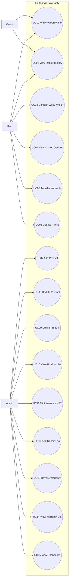

## 2.5 Use Case Diagram

### 2.5.1 Tổng quan Use Case Diagram của hệ thống

Use Case Diagram được sử dụng để mô tả các chức năng chính của hệ thống và cách các tác nhân tương tác với hệ thống. Sơ đồ này giúp xác định phạm vi nghiệp vụ, các dịch vụ hệ thống cần cung cấp và mối liên hệ giữa từng nhóm người dùng với từng chức năng.

Trong hệ thống Quản lý và Cấp phát Phiếu Bảo hành Điện tử (E-Warranty) theo kiến trúc Hybrid Blockchain, các tác nhân chính gồm:

- Guest (Khách vãng lai): người dùng chưa đăng nhập, có nhu cầu tra cứu thông tin chính hãng và lịch sử sửa chữa theo số serial.
- User (Chủ sở hữu): khách hàng đã kết nối ví Web3 (MetaMask), có quyền xem tài sản số bảo hành và thực hiện chuyển nhượng.
- Admin (Quản trị viên/Cửa hàng): nhân sự vận hành nghiệp vụ, có quyền quản lý danh mục sản phẩm, cấp phát bảo hành, ghi nhận sửa chữa và xử lý vi phạm.

Hệ thống được tổ chức theo bốn nhóm chức năng:

- Nhóm chức năng tra cứu công khai.
- Nhóm chức năng quản lý tài sản số cho chủ sở hữu.
- Nhóm chức năng quản lý danh mục sản phẩm.
- Nhóm chức năng quản lý nghiệp vụ bảo hành (Web3 và Database).

Hình 2.x dưới đây mô tả Use Case Diagram tổng thể của hệ thống:

### 2.5.2 Danh sách Actors

| Actor | Mô tả                                                                                                  |
| :---- | :----------------------------------------------------------------------------------------------------- |
| Guest | Người dùng phổ thông sử dụng hệ thống để tra cứu nguồn gốc và lịch sử sửa chữa của máy.                |
| User  | Khách hàng sở hữu máy, truy cập hệ thống bằng ví điện tử để quản lý tài sản số (NFT).                  |
| Admin | Nhân viên cửa hàng hoặc kỹ thuật viên có quyền quản trị dữ liệu và thao tác nghiệp vụ trên Blockchain. |

### 2.5.3 Danh sách Use Cases của hệ thống

Nhóm chức năng tra cứu công khai

| ID   | Use Case            | Mô tả                                                       |
| :--- | :------------------ | :---------------------------------------------------------- |
| UC01 | View Warranty Info  | Tra cứu thông tin chính hãng và hạn bảo hành qua số Serial. |
| UC02 | View Repair History | Xem lịch sử các lần thay thế linh kiện, bảo hành của máy.   |

Nhóm chức năng quản lý tài sản số (dành cho chủ sở hữu)

| ID   | Use Case            | Mô tả                                                             |
| :--- | :------------------ | :---------------------------------------------------------------- |
| UC03 | Connect Web3 Wallet | Đăng nhập và xác thực hệ thống bằng ví MetaMask.                  |
| UC04 | View Owned Devices  | Hiển thị danh sách các NFT bảo hành thuộc sở hữu của ví.          |
| UC05 | Transfer Warranty   | Chuyển nhượng NFT bảo hành sang địa chỉ ví người khác.            |
| UC06 | Update Profile      | Cập nhật thông tin liên hệ (email, số điện thoại) của chủ sở hữu. |

Nhóm chức năng quản lý danh mục sản phẩm

| ID   | Use Case          | Mô tả                                                          |
| :--- | :---------------- | :------------------------------------------------------------- |
| UC07 | Add Product       | Thêm thông tin cấu hình một dòng sản phẩm mới.                 |
| UC08 | Update Product    | Cập nhật thông tin giá, cấu hình, tháng bảo hành của sản phẩm. |
| UC09 | Delete Product    | Xóa hoặc ẩn một dòng sản phẩm khỏi hệ thống.                   |
| UC10 | View Product List | Xem danh sách các sản phẩm đang được quản lý.                  |

Nhóm chức năng quản lý nghiệp vụ bảo hành

| ID   | Use Case           | Mô tả                                                                                                          |
| :--- | :----------------- | :------------------------------------------------------------------------------------------------------------- |
| UC11 | Mint Warranty NFT  | Cấp phát phiếu bảo hành mới (đúc NFT) lên Blockchain cho khách.                                                |
| UC12 | Add Repair Log     | Ghi nhận chi tiết lịch sử sửa chữa (lỗi, chi phí, kỹ thuật viên).                                              |
| UC13 | Revoke Warranty    | Hủy phiếu bảo hành nếu khách hàng vi phạm quy định.                                                            |
| UC14 | View Warranty List | Xem danh sách toàn bộ phiếu bảo hành đã cấp phát trên hệ thống.                                                |
| UC15 | View Dashboard     | Xem màn hình tổng quan (tổng số máy đã bán, số phiếu bảo hành đang Active, tổng số lượt sửa chữa trong tháng). |

### 2.5.4 Đặc tả Use Case chi tiết

Use Case 1: Tra cứu thông tin bảo hành (View Warranty Info)

| Thuộc tính      | Mô tả                                                                                                   |
| --------------- | ------------------------------------------------------------------------------------------------------- |
| Mã Use Case     | UC01                                                                                                    |
| Tên Use Case    | Tra cứu thông tin bảo hành                                                                              |
| Tác nhân        | Guest, User, Admin                                                                                      |
| Mô tả           | Cho phép người dùng tra cứu thông tin chính hãng và thời hạn bảo hành của thiết bị thông qua số Serial. |
| Điều kiện trước | Hệ thống đang hoạt động bình thường.                                                                    |
| Điều kiện sau   | Thông tin bảo hành của thiết bị được hiển thị trên giao diện.                                           |

Luồng chính

1. Người dùng chọn chức năng Tra cứu bảo hành.
2. Người dùng nhập số Serial của thiết bị vào ô tìm kiếm và nhấn Tra cứu.
3. Hệ thống (Backend) thực hiện băm (Hash) số Serial.
4. Hệ thống truy vấn cơ sở dữ liệu để kiểm tra trạng thái phiếu bảo hành tương ứng.
5. Hệ thống hiển thị thông tin chi tiết (thời hạn, trạng thái, dòng máy) lên màn hình.

Use Case 2: Xem lịch sử sửa chữa (View Repair History)

| Thuộc tính      | Mô tả                                                                                      |
| --------------- | ------------------------------------------------------------------------------------------ |
| Mã Use Case     | UC02                                                                                       |
| Tên Use Case    | Xem lịch sử sửa chữa                                                                       |
| Tác nhân        | Guest, User, Admin                                                                         |
| Mô tả           | Cho phép người dùng xem toàn bộ lịch sử các lần sửa chữa, thay thế linh kiện của thiết bị. |
| Điều kiện trước | Người dùng đã tra cứu thành công thông tin thiết bị (UC01).                                |
| Điều kiện sau   | Danh sách các lần sửa chữa được hiển thị chi tiết.                                         |

Luồng chính

1. Từ màn hình kết quả tra cứu, người dùng chọn xem Lịch sử sửa chữa.
2. Hệ thống lấy TokenID của thiết bị để truy vấn bảng lịch sử sửa chữa (Repair Log).
3. Hệ thống lấy dữ liệu và trả về Frontend.
4. Hệ thống hiển thị danh sách các lần bảo hành (thời gian, nội dung, kỹ thuật viên, chi phí).

Use Case 3: Kết nối ví Web3 (Connect Web3 Wallet)

| Thuộc tính      | Mô tả                                                                                           |
| --------------- | ----------------------------------------------------------------------------------------------- |
| Mã Use Case     | UC03                                                                                            |
| Tên Use Case    | Kết nối ví Web3                                                                                 |
| Tác nhân        | User, Admin                                                                                     |
| Mô tả           | Cho phép người dùng đăng nhập hệ thống bằng ví điện tử MetaMask thay cho mật khẩu truyền thống. |
| Điều kiện trước | Trình duyệt người dùng đã cài đặt tiện ích MetaMask.                                            |
| Điều kiện sau   | Người dùng đăng nhập thành công và được cấp quyền truy cập hệ thống.                            |

Luồng chính

1. Người dùng nhấn nút "Connect Wallet" trên giao diện.
2. Giao diện gọi tiện ích MetaMask hiển thị yêu cầu kết nối.
3. Người dùng chọn tài khoản ví và xác nhận kết nối.
4. Hệ thống yêu cầu ký một tin nhắn (Sign Message) để xác minh chủ sở hữu ví.
5. Người dùng ký tin nhắn trên MetaMask.
6. Hệ thống đối chiếu thông tin và chuyển hướng vào trang quản lý tương ứng với phân quyền (Admin/User).

Use Case 4: Xem thiết bị đang sở hữu (View Owned Devices)

| Thuộc tính      | Mô tả                                                                          |
| --------------- | ------------------------------------------------------------------------------ |
| Mã Use Case     | UC04                                                                           |
| Tên Use Case    | Xem thiết bị đang sở hữu                                                       |
| Tác nhân        | User                                                                           |
| Mô tả           | Hiển thị danh sách toàn bộ các phiếu bảo hành (NFT) mà người dùng đang sở hữu. |
| Điều kiện trước | Người dùng đã đăng nhập thành công bằng ví MetaMask (UC03).                    |
| Điều kiện sau   | Danh sách thiết bị sở hữu được hiển thị.                                       |

Luồng chính

1. Người dùng truy cập trang "Tài sản của tôi".
2. Hệ thống lấy địa chỉ ví (walletAddress) của người dùng hiện tại.
3. Hệ thống truy vấn cơ sở dữ liệu để tìm các phiếu bảo hành có chủ sở hữu khớp với địa chỉ ví.
4. Hệ thống hiển thị danh sách các thiết bị và trạng thái bảo hành lên màn hình.

Use Case 5: Chuyển nhượng quyền bảo hành (Transfer Warranty)

| Thuộc tính      | Mô tả                                                                                                        |
| --------------- | ------------------------------------------------------------------------------------------------------------ |
| Mã Use Case     | UC05                                                                                                         |
| Tên Use Case    | Chuyển nhượng quyền bảo hành                                                                                 |
| Tác nhân        | User                                                                                                         |
| Mô tả           | Cho phép chủ sở hữu chuyển quyền sở hữu phiếu bảo hành (NFT) sang địa chỉ ví của người khác khi bán lại máy. |
| Điều kiện trước | Người dùng đã đăng nhập và chọn một thiết bị đang sở hữu hợp lệ.                                             |
| Điều kiện sau   | Quyền sở hữu NFT được chuyển sang ví mới trên Blockchain và cập nhật trên Database.                          |

Luồng chính

1. Người dùng chọn chức năng Chuyển nhượng trên một thiết bị cụ thể.
2. Người dùng nhập địa chỉ ví MetaMask của người nhận.
3. Hệ thống gọi MetaMask yêu cầu xác nhận giao dịch chuyển NFT (Transfer).
4. Người dùng xác nhận và trả phí Gas trên mạng Blockchain (Sepolia).
5. Smart Contract thực hiện lệnh đổi chủ sở hữu.
6. Hệ thống Backend nhận kết quả, lưu lịch sử chuyển nhượng và cập nhật chủ mới vào cơ sở dữ liệu.
7. Hệ thống hiển thị thông báo chuyển nhượng thành công.

Use Case 6: Cập nhật hồ sơ (Update Profile)

| Thuộc tính      | Mô tả                                                                                   |
| --------------- | --------------------------------------------------------------------------------------- |
| Mã Use Case     | UC06                                                                                    |
| Tên Use Case    | Cập nhật hồ sơ                                                                          |
| Tác nhân        | User                                                                                    |
| Mô tả           | Cho phép người dùng cập nhật các thông tin liên hệ cá nhân (email, số điện thoại, tên). |
| Điều kiện trước | Người dùng đã đăng nhập vào hệ thống.                                                   |
| Điều kiện sau   | Thông tin hồ sơ người dùng được cập nhật mới.                                           |

Luồng chính

1. Người dùng truy cập trang Quản lý hồ sơ.
2. Người dùng nhập các thông tin mới (Email, Số điện thoại...).
3. Người dùng nhấn nút Lưu thay đổi.
4. Hệ thống kiểm tra tính hợp lệ của dữ liệu.
5. Hệ thống cập nhật bản ghi trong cơ sở dữ liệu.
6. Hệ thống hiển thị thông báo cập nhật thành công.

Use Case 7: Thêm sản phẩm mới (Add Product)

| Thuộc tính      | Mô tả                                                                                 |
| --------------- | ------------------------------------------------------------------------------------- |
| Mã Use Case     | UC07                                                                                  |
| Tên Use Case    | Thêm sản phẩm mới                                                                     |
| Tác nhân        | Admin                                                                                 |
| Mô tả           | Cho phép quản trị viên thêm một cấu hình dòng sản phẩm mới vào danh mục của hệ thống. |
| Điều kiện trước | Admin đã đăng nhập hệ thống với quyền quản trị.                                       |
| Điều kiện sau   | Thông tin sản phẩm mới được lưu vào hệ thống.                                         |

Luồng chính

1. Admin chọn chức năng Thêm sản phẩm mới.
2. Admin nhập các thông tin: Mã SP, Tên SP, Thương hiệu, Giá, Cấu hình, Thời hạn bảo hành gốc.
3. Admin nhấn nút Lưu.
4. Hệ thống kiểm tra dữ liệu đầu vào (Mã SP không được trùng lặp).
5. Hệ thống lưu bản ghi vào cơ sở dữ liệu (Product Database).
6. Hệ thống hiển thị thông báo thêm mới thành công.

Use Case 8: Cập nhật sản phẩm (Update Product)

| Thuộc tính      | Mô tả                                                                        |
| --------------- | ---------------------------------------------------------------------------- |
| Mã Use Case     | UC08                                                                         |
| Tên Use Case    | Cập nhật sản phẩm                                                            |
| Tác nhân        | Admin                                                                        |
| Mô tả           | Cho phép quản trị viên chỉnh sửa thông tin của một dòng sản phẩm đã tồn tại. |
| Điều kiện trước | Admin đã đăng nhập; Danh sách sản phẩm đã được hiển thị.                     |
| Điều kiện sau   | Thông tin sản phẩm được cập nhật.                                            |

Luồng chính

1. Admin chọn chức năng Chỉnh sửa trên một sản phẩm cụ thể.
2. Admin thay đổi các thông tin cần thiết (Giá bán, Cấu hình...).
3. Admin nhấn nút Lưu.
4. Hệ thống đối chiếu và cập nhật thông tin trong cơ sở dữ liệu.
5. Hệ thống hiển thị thông báo cập nhật thành công.

Use Case 9: Xóa sản phẩm (Delete Product)

| Thuộc tính      | Mô tả                                                                                  |
| --------------- | -------------------------------------------------------------------------------------- |
| Mã Use Case     | UC09                                                                                   |
| Tên Use Case    | Xóa sản phẩm                                                                           |
| Tác nhân        | Admin                                                                                  |
| Mô tả           | Cho phép quản trị viên vô hiệu hóa (xóa mềm) một dòng sản phẩm khỏi danh mục hiển thị. |
| Điều kiện trước | Admin đã đăng nhập; Danh sách sản phẩm đã được hiển thị.                               |
| Điều kiện sau   | Sản phẩm chuyển sang trạng thái ngưng hoạt động (Inactive).                            |

Luồng chính

1. Admin chọn chức năng Xóa trên một sản phẩm.
2. Hệ thống hiển thị hộp thoại xác nhận yêu cầu xóa.
3. Admin nhấn Xác nhận.
4. Hệ thống cập nhật trạng thái của sản phẩm thành isActive = false trong cơ sở dữ liệu.
5. Hệ thống tải lại danh sách, ẩn sản phẩm vừa xóa và hiển thị thông báo thành công.

Use Case 10: Xem danh sách sản phẩm (View Product List)

| Thuộc tính      | Mô tả                                                                        |
| --------------- | ---------------------------------------------------------------------------- |
| Mã Use Case     | UC10                                                                         |
| Tên Use Case    | Xem danh sách sản phẩm                                                       |
| Tác nhân        | Admin                                                                        |
| Mô tả           | Cho phép quản trị viên xem danh sách toàn bộ các dòng máy đang được quản lý. |
| Điều kiện trước | Admin đã đăng nhập hệ thống.                                                 |
| Điều kiện sau   | Danh sách sản phẩm được hiển thị trên bảng quản lý.                          |

Luồng chính

1. Admin truy cập trang Quản lý danh mục sản phẩm.
2. Hệ thống truy vấn cơ sở dữ liệu để lấy toàn bộ danh sách sản phẩm đang hoạt động.
3. Hệ thống trả dữ liệu và hiển thị lên bảng (có hỗ trợ phân trang).

Use Case 11: Cấp phát phiếu bảo hành (Mint Warranty NFT)

| Thuộc tính      | Mô tả                                                                                      |
| --------------- | ------------------------------------------------------------------------------------------ |
| Mã Use Case     | UC11                                                                                       |
| Tên Use Case    | Cấp phát phiếu bảo hành (Mint NFT)                                                         |
| Tác nhân        | Admin                                                                                      |
| Mô tả           | Khởi tạo một phiếu bảo hành điện tử dưới dạng NFT trên Blockchain cho thiết bị mới bán ra. |
| Điều kiện trước | Admin đã đăng nhập; Thiết bị (Serial) chưa từng được cấp bảo hành.                         |
| Điều kiện sau   | NFT được đúc thành công trên Blockchain; Dữ liệu đồng bộ xuống Database.                   |

Luồng chính

1. Admin chọn chức năng Cấp phát bảo hành mới.
2. Admin nhập Số Serial của thiết bị, chọn dòng máy và nhập địa chỉ ví MetaMask của khách hàng.
3. Admin nhấn Xác nhận cấp phát.
4. Giao diện gọi MetaMask yêu cầu Admin ký giao dịch đúc NFT (Mint).
5. Admin xác nhận và trả phí Gas trên mạng lưới Blockchain.
6. Smart Contract xử lý và trả về TokenID cùng mã băm giao dịch (txHash).
7. Hệ thống Backend băm số Serial, lưu TokenID, SerialHash và các thông tin liên quan vào cơ sở dữ liệu.
8. Hệ thống hiển thị thông báo cấp phát hoàn tất.

Use Case 12: Ghi nhận lịch sử sửa chữa (Add Repair Log)

| Thuộc tính      | Mô tả                                                                                                        |
| --------------- | ------------------------------------------------------------------------------------------------------------ |
| Mã Use Case     | UC12                                                                                                         |
| Tên Use Case    | Ghi nhận lịch sử sửa chữa                                                                                    |
| Tác nhân        | Admin                                                                                                        |
| Mô tả           | Cho phép kỹ thuật viên cập nhật thông tin lỗi, linh kiện thay thế và chi phí mỗi khi thiết bị được sửa chữa. |
| Điều kiện trước | Admin đã đăng nhập; Thiết bị đang có trạng thái bảo hành hợp lệ.                                             |
| Điều kiện sau   | Bản ghi lịch sử sửa chữa được thêm mới vào hệ thống.                                                         |

Luồng chính

1. Admin tra cứu thiết bị cần ghi log thông qua số Serial.
2. Admin chọn chức năng Thêm lịch sử sửa chữa.
3. Admin nhập các thông tin: Nội dung lỗi, Linh kiện thay thế, Chi phí, Tên kỹ thuật viên.
4. Admin nhấn nút Lưu thông tin.
5. Hệ thống kiểm tra và lưu bản ghi vào bảng lịch sử sửa chữa (Repair Log Database).
6. Hệ thống hiển thị thông báo ghi nhận thành công.

Use Case 13: Hủy phiếu bảo hành (Revoke Warranty)

| Thuộc tính      | Mô tả                                                                                                                          |
| --------------- | ------------------------------------------------------------------------------------------------------------------------------ |
| Mã Use Case     | UC13                                                                                                                           |
| Tên Use Case    | Hủy phiếu bảo hành                                                                                                             |
| Tác nhân        | Admin                                                                                                                          |
| Mô tả           | Cho phép quản trị viên vô hiệu hóa phiếu bảo hành NFT nếu phát hiện thiết bị vi phạm chính sách (ví dụ: bị tháo mở trái phép). |
| Điều kiện trước | Admin đã đăng nhập; Phiếu bảo hành đang ở trạng thái hoạt động (Active).                                                       |
| Điều kiện sau   | Phiếu bảo hành bị vô hiệu hóa trên cả Blockchain và Database.                                                                  |

Luồng chính

1. Admin tìm kiếm và chọn phiếu bảo hành cần hủy.
2. Admin chọn chức năng Hủy bảo hành (Revoke) và nhập lý do hủy.
3. Hệ thống gọi MetaMask yêu cầu Admin ký giao dịch.
4. Admin xác nhận ký lệnh thu hồi trên Blockchain.
5. Smart Contract cập nhật trạng thái NFT thành không hợp lệ (Revoked).
6. Hệ thống Backend ghi nhận kết quả và cập nhật trạng thái tương ứng trong Database.
7. Hệ thống hiển thị thông báo hủy bảo hành thành công.

Use Case 14: Xem danh sách phiếu bảo hành (View Warranty List)

| Thuộc tính      | Mô tả                                                                                            |
| --------------- | ------------------------------------------------------------------------------------------------ |
| Mã Use Case     | UC14                                                                                             |
| Tên Use Case    | Xem danh sách phiếu bảo hành                                                                     |
| Tác nhân        | Admin                                                                                            |
| Mô tả           | Cho phép quản trị viên xem và quản lý toàn bộ các phiếu bảo hành đã được cấp phát trên hệ thống. |
| Điều kiện trước | Admin đã đăng nhập hệ thống.                                                                     |
| Điều kiện sau   | Danh sách phiếu bảo hành được hiển thị.                                                          |

Luồng chính

1. Admin truy cập trang Quản lý phiếu bảo hành.
2. Hệ thống truy vấn cơ sở dữ liệu để lấy toàn bộ dữ liệu từ bảng Warranties.
3. Hệ thống trả về danh sách bao gồm: TokenID, Dòng máy, Ngày cấp, Thời hạn và Trạng thái.
4. Hệ thống hiển thị dữ liệu lên bảng quản lý.

Use Case 15: Xem Dashboard (View Dashboard)

| Thuộc tính      | Mô tả                                                                                                                                                                           |
| --------------- | ------------------------------------------------------------------------------------------------------------------------------------------------------------------------------- |
| Mã Use Case     | UC15                                                                                                                                                                            |
| Tên Use Case    | Xem Dashboard (Thống kê tổng quan)                                                                                                                                              |
| Tác nhân        | Admin                                                                                                                                                                           |
| Mô tả           | Cho phép quản trị viên xem màn hình tổng quan báo cáo các số liệu quan trọng của hệ thống (tổng số máy đã bán, số phiếu bảo hành đang hoạt động, số lượt sửa chữa trong tháng). |
| Điều kiện trước | Admin đã đăng nhập hệ thống với quyền quản trị.                                                                                                                                 |
| Điều kiện sau   | Các số liệu và biểu đồ thống kê được hiển thị đầy đủ trên màn hình.                                                                                                             |

Luồng chính

1. Admin truy cập vào trang chủ quản trị (Trang Dashboard).
2. Hệ thống (Backend) đồng thời gọi các luồng truy vấn đến cơ sở dữ liệu (Warranties Database và Repair Log Database).
3. Hệ thống tiến hành tổng hợp, tính toán các số liệu (Tổng số NFT bảo hành đã cấp phát, Tỷ lệ NFT còn hạn/hết hạn, Tổng chi phí sửa chữa theo tháng).
4. Hệ thống trả dữ liệu đã tổng hợp về cho Frontend.
5. Giao diện (Frontend) vẽ các biểu đồ (chart) và hiển thị các thẻ số liệu (cards) lên màn hình cho Admin.

## 2.6 Sơ đồ luồng dữ liệu của ứng dụng (Data Flow Diagram - DFD)

Sơ đồ luồng dữ liệu (Data Flow Diagram - DFD) là một công cụ quan trọng trong quá trình phân tích và thiết kế hệ thống thông tin. DFD được sử dụng nhằm mô tả cách dữ liệu được xử lý, lưu trữ và luân chuyển giữa các thành phần khác nhau trong hệ thống. Thông qua việc sử dụng DFD, các nhà phát triển có thể hiểu rõ quá trình xử lý dữ liệu trong hệ thống, từ đó hỗ trợ việc thiết kế và triển khai hệ thống một cách hiệu quả.

Trong mô hình DFD, hệ thống được mô tả thông qua bốn thành phần cơ bản:

- External Entity (Tác nhân ngoài): là các đối tượng bên ngoài hệ thống nhưng có sự tương tác với hệ thống thông qua việc gửi hoặc nhận dữ liệu.
- Process (Tiến trình): biểu diễn các hoạt động xử lý dữ liệu trong hệ thống.
- Data Store (Kho dữ liệu): nơi lưu trữ dữ liệu của hệ thống, thường là cơ sở dữ liệu.
- Data Flow (Luồng dữ liệu): thể hiện sự di chuyển của dữ liệu giữa các thành phần trong hệ thống.

Đối với hệ thống Quản lý và Cấp phát Phiếu bảo hành Điện tử (E-Warranty) ứng dụng Blockchain, DFD được sử dụng để mô tả cách dữ liệu được trao đổi giữa người dùng, quản trị viên, Smart Contract và các thành phần xử lý trong hệ thống. Hệ thống cho phép người dùng tra cứu thông tin máy, xem tài sản NFT, đồng thời hỗ trợ cửa hàng thực hiện các chức năng đúc NFT và quản lý lịch sử sửa chữa.

Để mô tả hệ thống một cách rõ ràng, DFD được xây dựng theo ba cấp độ bao gồm:

- DFD Level 0 (Context Diagram): mô tả hệ thống ở mức tổng quan.
- DFD Level 1: phân rã hệ thống thành các chức năng chính.
- DFD Level 2: mô tả chi tiết các tiến trình xử lý dữ liệu.

### 2.6.1 Sơ đồ ngữ cảnh của hệ thống (DFD Level 0)

Sơ đồ luồng dữ liệu mức 0 (DFD Level 0), còn gọi là Context Diagram, mô tả tổng quan hệ thống và cách hệ thống tương tác với các tác nhân bên ngoài. Trong hệ thống E-Warranty, toàn bộ hệ thống được biểu diễn bằng một tiến trình duy nhất là E-Warranty Management System. Hệ thống nhận các yêu cầu từ người dùng, quản trị viên và mạng lưới Blockchain, sau đó xử lý và trả lại các thông tin tương ứng.

Các tác nhân bên ngoài bao gồm:

- Guest: Người dùng chưa đăng nhập, có thể gửi yêu cầu tra cứu thông tin bảo hành và lịch sử sửa chữa thông qua số Serial.
- User: Chủ sở hữu thiết bị, có thể kết nối ví Web3 để xem danh sách tài sản bảo hành và thực hiện yêu cầu chuyển nhượng (Transfer).
- Admin/Manager: Quản trị viên cửa hàng có quyền quản lý danh mục sản phẩm, cấp phát phiếu bảo hành mới (Mint NFT), cập nhật lịch sử sửa chữa và xem báo cáo thống kê.
- Smart Contract (Mạng Sepolia): Nguồn dữ liệu on-chain, tiếp nhận lệnh giao dịch và trả về các bằng chứng xác thực (txHash, TokenID).

Thông qua các tương tác này, hệ thống tiếp nhận dữ liệu đầu vào từ các tác nhân bên ngoài, thực hiện xử lý và cung cấp các thông tin đầu ra phù hợp. (Hình 2.x minh họa sơ đồ ngữ cảnh của hệ thống E-Warranty)

### 2.6.2 Sơ đồ luồng dữ liệu mức 1 (DFD Level 1)

Sơ đồ DFD Level 1 được xây dựng bằng cách phân rã tiến trình tổng thể của hệ thống thành các tiến trình xử lý chính nhằm mô tả chi tiết hơn cách dữ liệu được xử lý và luân chuyển trong hệ thống. Trong hệ thống E-Warranty Blockchain, tiến trình trung tâm được phân rã thành năm tiến trình chính như sau:

1.0 Quản lý sản phẩm và người dùng: Tiến trình này chịu trách nhiệm xử lý các yêu cầu liên quan đến việc cấu hình danh mục máy móc và hồ sơ người dùng. Hệ thống sẽ truy vấn và lưu trữ dữ liệu từ Product Database và User Database, sau đó hiển thị kết quả trên giao diện.

2.0 Quản lý nghiệp vụ bảo hành (Web3): Tiến trình này cho phép Admin thực hiện cấp phát (Mint) phiếu bảo hành mới, hoặc User thực hiện chuyển nhượng quyền sở hữu. Hệ thống tương tác với Smart Contract và lưu trữ dữ liệu đồng bộ vào Warranty Database.

3.0 Quản lý lịch sử sửa chữa: Tiến trình này xử lý các nghiệp vụ liên quan đến việc bảo hành thiết bị, bao gồm thêm mới log sửa chữa, cập nhật chi phí và linh kiện. Các dữ liệu được lưu trữ và quản lý trong Repair Log Database.

4.0 Tra cứu và trích xuất: Tiến trình này thực hiện việc truy vấn nhanh dữ liệu từ Warranty Database và Repair Log Database dựa trên số Serial nhằm hiển thị thông tin chính hãng cho Guest mà không cần gọi dữ liệu từ Blockchain.

5.0 Thống kê và báo cáo: Tiến trình này tổng hợp dữ liệu từ các cơ sở dữ liệu để tạo ra dashboard báo cáo (số lượng máy đã bán, chi phí sửa chữa) phục vụ cho việc quản lý của Admin.

Các kho dữ liệu chính được sử dụng trong hệ thống bao gồm:

- Product Database: lưu trữ thông tin cấu hình và giá các dòng máy.
- User Database: lưu trữ thông tin tài khoản ví Web3 và liên hệ.
- Warranty Database: lưu trữ thông tin chi tiết các phiếu bảo hành (TokenID, SerialHash).
- Repair Log Database: lưu trữ dữ liệu chi tiết các lần sửa chữa.
- Transfer History Database: lưu trữ lịch sử sang tên thiết bị.

Dựa trên cấu trúc của sơ đồ luồng dữ liệu mức 1, các tương tác giữa tác nhân và hệ thống được cụ thể hóa thông qua bảng đặc tả đầu vào/đầu ra dưới đây.

Bảng 2.1: Đặc tả chi tiết các tiến trình trong sơ đồ DFD Mức 1

| STT | Tên tiến trình                 | Luồng dữ liệu vào (Input)                                   | Luồng dữ liệu ra (Output)                                   | Mô tả chức năng                                                                            |
| :-- | :----------------------------- | :---------------------------------------------------------- | :---------------------------------------------------------- | :----------------------------------------------------------------------------------------- |
| 1.0 | Quản lý sản phẩm và người dùng | Yêu cầu thêm/sửa từ Admin; dữ liệu hồ sơ từ User            | Giao diện danh sách sản phẩm; thông báo cập nhật thành công | Quản lý vòng đời của danh mục sản phẩm và thông tin định danh của người dùng ví Web3       |
| 2.0 | Quản lý nghiệp vụ bảo hành     | Lệnh Mint/Transfer từ Admin/User; dữ liệu từ Smart Contract | Lệnh giao dịch on-chain; bản ghi TokenID mới                | Thực thi các nghiệp vụ lõi tương tác với Blockchain và lưu vết đồng bộ xuống cơ sở dữ liệu |
| 3.0 | Quản lý lịch sử sửa chữa       | Thông tin lỗi, chi phí, linh kiện thay thế từ Admin         | Bản ghi sửa chữa mới; cập nhật trạng thái bảo hành          | Ghi nhận các can thiệp kỹ thuật lên thiết bị, đảm bảo minh bạch lịch sử hậu mãi            |
| 4.0 | Tra cứu và trích xuất          | Số Serial từ Guest; yêu cầu xem tài sản từ User             | Thông tin chi tiết bảo hành và mảng lịch sử sửa chữa        | Tối ưu hóa truy vấn off-chain để trả về kết quả nhanh chóng cho người dùng tra cứu         |
| 5.0 | Thống kê và báo cáo            | Dữ liệu từ CSDL bảo hành và CSDL lịch sử sửa chữa           | Biểu đồ tổng quan, số liệu thống kê                         | Tổng hợp dữ liệu phục vụ quản trị và đánh giá hiệu quả kinh doanh của cửa hàng             |

Bảng 2.2: Đặc tả các kho dữ liệu (Data Stores)

| Mã kho | Tên kho dữ liệu           | Nội dung lưu trữ chính                                                 |
| :----- | :------------------------ | :--------------------------------------------------------------------- |
| D1     | Product Database          | Mã sản phẩm, tên máy, cấu hình, giá bán, thời hạn bảo hành             |
| D2     | User Database             | Địa chỉ ví MetaMask, email, số điện thoại, phân quyền (Role)           |
| D3     | Warranty Database         | TokenID, SerialHash, địa chỉ ví chủ sở hữu, ngày kích hoạt, trạng thái |
| D4     | Repair Log Database       | Mã NFT tham chiếu, mô tả lỗi, linh kiện, chi phí, kỹ thuật viên xử lý  |
| D5     | Transfer History Database | Mã NFT tham chiếu, ví người bán, ví người mua, mã giao dịch (txHash)   |

### 2.6.3 Sơ đồ luồng dữ liệu mức 2 (DFD Level 2)

Sơ đồ luồng dữ liệu mức 2 (DFD Level 2) được xây dựng nhằm mô tả chi tiết hơn các tiến trình đã được trình bày trong sơ đồ DFD Level 1. Ở mức này, các tiến trình chính của hệ thống được phân rã thành những tiến trình nhỏ hơn nhằm thể hiện rõ cách dữ liệu được xử lý và luân chuyển. Trong hệ thống E-Warranty, tiến trình Quản lý nghiệp vụ bảo hành (2.0) và Quản lý lịch sử sửa chữa (3.0) được phân rã chi tiết như sau.

Phân rã tiến trình quản lý nghiệp vụ bảo hành (Process 2.0)

Tiến trình này đóng vai trò kết nối giữa người dùng, Backend và Blockchain. Các tiến trình con bao gồm:

- 2.1 Cấp phát NFT bảo hành: Admin nhập thông tin máy bán ra. Hệ thống yêu cầu ký ví, gửi giao dịch Mint lên Blockchain và lưu dữ liệu vào Warranty Database.
- 2.2 Chuyển nhượng quyền (Transfer): User yêu cầu chuyển NFT cho ví khác. Hệ thống xử lý giao dịch trên chuỗi và lưu vào Transfer History Database.
- 2.3 Hủy bảo hành (Revoke): Admin thu hồi quyền bảo hành khi có vi phạm. Hệ thống cập nhật trạng thái NFT thành vô hiệu hóa.

| Chức năng     | Đối tượng thực hiện | Dữ liệu đầu vào             | Kết quả đầu ra                        |
| :------------ | :------------------ | :-------------------------- | :------------------------------------ |
| Cấp phát NFT  | Admin               | Số Serial, địa chỉ ví khách | TokenID và txHash được lưu vào DB     |
| Chuyển nhượng | User                | Địa chỉ ví người nhận       | Quyền sở hữu NFT được đổi sang ví mới |
| Hủy bảo hành  | Admin               | Mã TokenID, lý do hủy       | Trạng thái NFT chuyển thành Inactive  |

Phân rã tiến trình quản lý lịch sử sửa chữa (Process 3.0)

Tiến trình này hỗ trợ vận hành công tác hậu mãi tại cửa hàng. Các tiến trình con bao gồm:

- 3.1 Tra cứu thiết bị bảo hành: Admin tra cứu thông tin máy trước khi tiếp nhận sửa chữa dựa trên số Serial hoặc TokenID.
- 3.2 Thêm mới log sửa chữa: Admin nhập chi tiết lỗi, hệ thống lưu bản ghi mới vào Repair Log Database.
- 3.3 Trích xuất báo cáo sửa chữa: Hệ thống tổng hợp các ca sửa chữa trong tháng để phục vụ kế toán.

| Tiến trình       | Dữ liệu đầu vào (Input)                           | Dữ liệu đầu ra (Output)                    | Mô tả hành động                                                       |
| :--------------- | :------------------------------------------------ | :----------------------------------------- | :-------------------------------------------------------------------- |
| Tra cứu thiết bị | Số Serial hoặc TokenID                            | Dữ liệu trạng thái phiếu bảo hành hiện tại | Hệ thống kiểm tra xem máy còn hạn bảo hành hay đã bị từ chối bảo hành |
| Thêm mới log     | Chi tiết lỗi, linh kiện, chi phí, người phụ trách | Bản ghi mới lưu vào Repair Log Database    | Lưu vết off-chain các lần can thiệp vật lý vào thiết bị               |

## 2.7 Sơ đồ trình tự (Sequence Diagram)

Sơ đồ trình tự (Sequence Diagram) được sử dụng để mô tả trình tự tương tác giữa các thành phần của hệ thống theo thời gian khi thực hiện một chức năng cụ thể. Thông qua sơ đồ này, có thể thấy được cách mà tác nhân (Actor), giao diện hệ thống, các dịch vụ xử lý và cơ sở dữ liệu trao đổi thông tin với nhau để hoàn thành một nghiệp vụ.

Trong hệ thống E-Warranty Blockchain, các sơ đồ trình tự được xây dựng cho một số chức năng quan trọng nhằm mô tả chi tiết cách hệ thống xử lý yêu cầu on-chain và off-chain. Các sơ đồ được xây dựng bao gồm:

- Tra cứu thông tin bảo hành
- Kết nối ví Web3
- Cấp phát phiếu bảo hành (Mint NFT)
- Chuyển nhượng quyền bảo hành
- Ghi nhận lịch sử sửa chữa

### 2.7.1 Sơ đồ trình tự chức năng tra cứu thông tin bảo hành

Chức năng này cho phép Guest truy cập vào hệ thống để kiểm tra tình trạng máy mà không cần kết nối ví. Khi người dùng nhập số Serial, giao diện sẽ gửi yêu cầu đến Backend API. Hệ thống tiến hành băm số Serial và truy vấn Warranty Database để lấy TokenID, sau đó tiếp tục truy xuất Repair Log Database. Thông tin tổng hợp được trả về hiển thị trên giao diện một cách nhanh chóng. (Hình 2.20: Sequence Diagram - Tra cứu thông tin bảo hành)

### 2.7.2 Sơ đồ trình tự chức năng kết nối ví Web3

Chức năng này cho phép người dùng xác thực vào hệ thống thay cho mật khẩu truyền thống. Khi người dùng nhấn kết nối, giao diện gọi tiện ích MetaMask để lấy địa chỉ ví. Sau đó, hệ thống yêu cầu người dùng ký (Sign) một tin nhắn bảo mật. Backend nhận chữ ký, xác thực và cấp quyền truy cập (Session/JWT) tương ứng với vai trò lưu trong User Database. (Hình 2.21: Sequence Diagram - Kết nối ví Web3)

### 2.7.3 Sơ đồ trình tự chức năng cấp phát phiếu bảo hành (Mint NFT)

Chức năng này được sử dụng bởi Admin để khởi tạo bảo hành cho thiết bị mới. Admin nhập thông tin trên giao diện. Hệ thống gọi MetaMask yêu cầu Admin ký giao dịch. Giao dịch được gửi lên mạng lưới Smart Contract. Sau khi Blockchain sinh ra TokenID và txHash, hệ thống sẽ gửi các thông tin này cho Backend API để lưu trữ đồng bộ xuống Warranty Database. (Hình 2.22: Sequence Diagram - Cấp phát phiếu bảo hành)

### 2.7.4 Sơ đồ trình tự chức năng chuyển nhượng quyền bảo hành

Chức năng này cho phép User sang tên thiết bị cho người khác. Người dùng nhập địa chỉ ví của người nhận và xác nhận giao dịch qua MetaMask. Smart Contract thực hiện việc đổi chủ sở hữu on-chain. Ngay khi thành công, Backend cập nhật bảng Transfer History Database để lưu vết. Hệ thống thông báo kết quả cho người dùng. (Hình 2.23: Sequence Diagram - Chuyển nhượng quyền)

### 2.7.5 Sơ đồ trình tự chức năng ghi nhận lịch sử sửa chữa

Chức năng này cho phép Admin cập nhật quá trình bảo hành. Quản trị viên nhập thông tin lỗi, linh kiện và chi phí. Giao diện gửi yêu cầu cho Backend API. Backend kiểm tra tính hợp lệ của TokenID và lưu trực tiếp bản ghi vào Repair Log Database (off-chain) để tiết kiệm phí Gas. Hệ thống trả về thông báo hoàn tất. (Hình 2.24: Sequence Diagram - Ghi nhận lịch sử sửa chữa)
