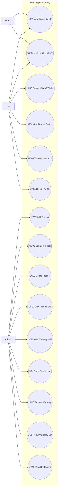
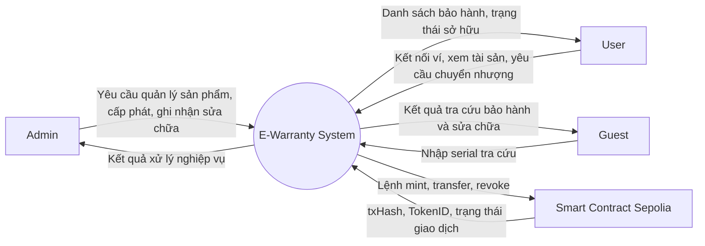
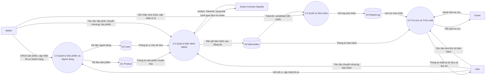
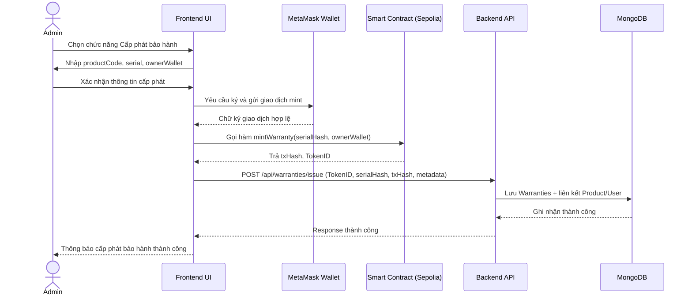
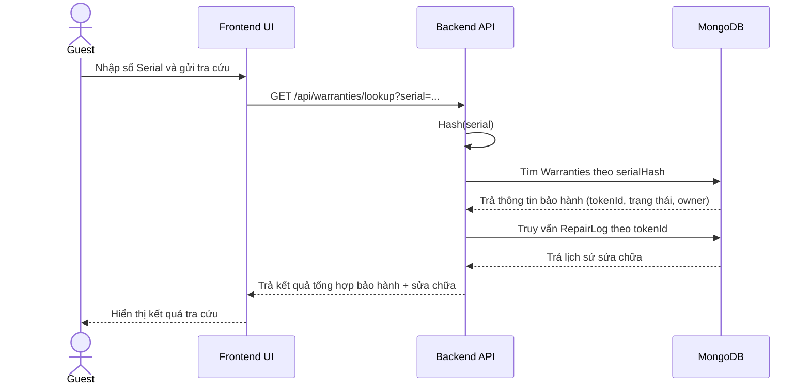

## 2.5 Use Case Diagram

### 2.5.1 Tổng quan Use Case Diagram của hệ thống

Use Case Diagram được sử dụng để mô tả các chức năng chính của hệ thống và cách các tác nhân tương tác với hệ thống. Sơ đồ này giúp xác định phạm vi nghiệp vụ, các dịch vụ hệ thống cần cung cấp và mối liên hệ giữa từng nhóm người dùng với từng chức năng.

Trong hệ thống Quản lý và Cấp phát Phiếu Bảo hành Điện tử (E-Warranty) theo kiến trúc Hybrid Blockchain, các tác nhân chính gồm:

- Guest (Khách vãng lai): người dùng chưa đăng nhập, có nhu cầu tra cứu thông tin chính hãng và lịch sử sửa chữa theo số serial.
- User (Chủ sở hữu): khách hàng đã kết nối ví Web3 (MetaMask), có quyền xem tài sản số bảo hành và thực hiện chuyển nhượng.
- Admin (Quản trị viên/Cửa hàng): nhân sự vận hành nghiệp vụ, có quyền quản lý danh mục sản phẩm, cấp phát bảo hành, ghi nhận sửa chữa và xử lý vi phạm.

Hệ thống được tổ chức theo bốn nhóm chức năng:

- Nhóm chức năng tra cứu công khai.
- Nhóm chức năng quản lý tài sản số cho chủ sở hữu.
- Nhóm chức năng quản lý danh mục sản phẩm.
- Nhóm chức năng quản lý nghiệp vụ bảo hành (Web3 và Database).

Hình 2.x dưới đây mô tả Use Case Diagram tổng thể của hệ thống:

### 2.5.2 Danh sách Actors

| Actor | Mô tả                                                                                                  |
| :---- | :----------------------------------------------------------------------------------------------------- |
| Guest | Người dùng phổ thông sử dụng hệ thống để tra cứu nguồn gốc và lịch sử sửa chữa của máy.                |
| User  | Khách hàng sở hữu máy, truy cập hệ thống bằng ví điện tử để quản lý tài sản số (NFT).                  |
| Admin | Nhân viên cửa hàng hoặc kỹ thuật viên có quyền quản trị dữ liệu và thao tác nghiệp vụ trên Blockchain. |

### 2.5.3 Danh sách Use Cases của hệ thống

Nhóm chức năng tra cứu công khai

| ID   | Use Case            | Mô tả                                                       |
| :--- | :------------------ | :---------------------------------------------------------- |
| UC01 | View Warranty Info  | Tra cứu thông tin chính hãng và hạn bảo hành qua số Serial. |
| UC02 | View Repair History | Xem lịch sử các lần thay thế linh kiện, bảo hành của máy.   |

Nhóm chức năng quản lý tài sản số (dành cho chủ sở hữu)

| ID   | Use Case            | Mô tả                                                             |
| :--- | :------------------ | :---------------------------------------------------------------- |
| UC03 | Connect Web3 Wallet | Đăng nhập và xác thực hệ thống bằng ví MetaMask.                  |
| UC04 | View Owned Devices  | Hiển thị danh sách các NFT bảo hành thuộc sở hữu của ví.          |
| UC05 | Transfer Warranty   | Chuyển nhượng NFT bảo hành sang địa chỉ ví người khác.            |
| UC06 | Update Profile      | Cập nhật thông tin liên hệ (email, số điện thoại) của chủ sở hữu. |

Nhóm chức năng quản lý danh mục sản phẩm

| ID   | Use Case          | Mô tả                                                          |
| :--- | :---------------- | :------------------------------------------------------------- |
| UC07 | Add Product       | Thêm thông tin cấu hình một dòng sản phẩm mới.                 |
| UC08 | Update Product    | Cập nhật thông tin giá, cấu hình, tháng bảo hành của sản phẩm. |
| UC09 | Delete Product    | Xóa hoặc ẩn một dòng sản phẩm khỏi hệ thống.                   |
| UC10 | View Product List | Xem danh sách các sản phẩm đang được quản lý.                  |

Nhóm chức năng quản lý nghiệp vụ bảo hành

| ID   | Use Case           | Mô tả                                                                                                          |
| :--- | :----------------- | :------------------------------------------------------------------------------------------------------------- |
| UC11 | Mint Warranty NFT  | Cấp phát phiếu bảo hành mới (đúc NFT) lên Blockchain cho khách.                                                |
| UC12 | Add Repair Log     | Ghi nhận chi tiết lịch sử sửa chữa (lỗi, chi phí, kỹ thuật viên).                                              |
| UC13 | Revoke Warranty    | Hủy phiếu bảo hành nếu khách hàng vi phạm quy định.                                                            |
| UC14 | View Warranty List | Xem danh sách toàn bộ phiếu bảo hành đã cấp phát trên hệ thống.                                                |
| UC15 | View Dashboard     | Xem màn hình tổng quan (tổng số máy đã bán, số phiếu bảo hành đang Active, tổng số lượt sửa chữa trong tháng). |

### 2.5.4 Đặc tả Use Case tiêu biểu

Use Case 11: Mint Warranty NFT

| Thuộc tính      | Mô tả                                                                                  |
| :-------------- | :------------------------------------------------------------------------------------- |
| Mã Use Case     | UC11                                                                                   |
| Tên Use Case    | Mint Warranty NFT                                                                      |
| Tác nhân        | Admin                                                                                  |
| Mô tả           | Đúc một NFT đại diện cho phiếu bảo hành và đồng bộ dữ liệu về cơ sở dữ liệu off-chain. |
| Điều kiện trước | Admin đã đăng nhập bằng ví có quyền cấp phát trên Smart Contract.                      |
| Điều kiện sau   | NFT được tạo trên Sepolia, TokenID và SerialHash được lưu vào bảng Warranties.         |

Luồng chính:

1. Admin chọn chức năng cấp phát bảo hành trên giao diện.
2. Admin nhập productCode, serial và địa chỉ ví người sở hữu.
3. Hệ thống băm serial để tạo serialHash.
4. Giao diện gửi yêu cầu ký giao dịch qua MetaMask.
5. Smart Contract xử lý mint và trả về txHash, TokenID.
6. Backend lưu TokenID, serialHash và thông tin liên quan vào MongoDB.
7. Hệ thống hiển thị thông báo cấp phát thành công.

## 2.6 Sơ đồ luồng dữ liệu của ứng dụng (Data Flow Diagram - DFD)

Sơ đồ luồng dữ liệu (DFD) được sử dụng để mô tả cách dữ liệu đi vào hệ thống, được xử lý tại các tiến trình nghiệp vụ, lưu trữ tại các kho dữ liệu và trả kết quả cho các tác nhân bên ngoài. Trong hệ thống E-Warranty theo kiến trúc Hybrid Blockchain, DFD giúp làm rõ ranh giới trách nhiệm giữa lớp on-chain (đúc và xác thực NFT bảo hành) và lớp off-chain (quản trị dữ liệu nghiệp vụ trong MongoDB).

### 2.6.1 Sơ đồ ngữ cảnh của hệ thống (DFD Level 0)

Ở mức ngữ cảnh, toàn bộ hệ thống được xem là một tiến trình duy nhất. Ba tác nhân ngoài hệ thống gồm Admin, User và Guest tương tác với tiến trình này thông qua các luồng dữ liệu nghiệp vụ. Ngoài ra, Smart Contract Sepolia được xem là thực thể ngoài hệ thống off-chain, nhận lệnh giao dịch và trả lại kết quả giao dịch để đồng bộ dữ liệu.

### 2.6.2 Sơ đồ luồng dữ liệu mức 1 (DFD Level 1)

Từ tiến trình tổng thể, hệ thống được phân rã thành bốn tiến trình cốt lõi: 1.0 Quản lý Sản phẩm và Người dùng, 2.0 Quản lý Bảo hành Web3, 3.0 Quản lý Sửa chữa, 4.0 Tra cứu. Dữ liệu được lưu tại bốn kho dữ liệu chính D1-D4 tương ứng với Product, User, Warranties và RepairLog.

### 2.6.3 Bảng đặc tả chi tiết các tiến trình (DFD Level 1)

| Mã tiến trình | Tên tiến trình                 | Luồng vào                                                                                    | Luồng ra                                                                                                      | Mô tả xử lý                                                                                                           |
| :------------ | :----------------------------- | :------------------------------------------------------------------------------------------- | :------------------------------------------------------------------------------------------------------------ | :-------------------------------------------------------------------------------------------------------------------- |
| 1.0           | Quản lý Sản phẩm và Người dùng | Yêu cầu CRUD sản phẩm từ Admin; yêu cầu cập nhật hồ sơ và kết nối ví từ User                 | Bản ghi Product vào D1; bản ghi User vào D2; dữ liệu chuẩn hóa cho 2.0                                        | Chuẩn hóa và kiểm tra dữ liệu sản phẩm/người dùng, đảm bảo ràng buộc nghiệp vụ trước khi các tiến trình khác sử dụng. |
| 2.0           | Quản lý Bảo hành Web3          | Yêu cầu mint/transfer/revoke từ Admin/User; dữ liệu sản phẩm từ D1; dữ liệu người dùng từ D2 | Lệnh giao dịch on-chain tới Smart Contract; kết quả txHash/TokenID từ Smart Contract; bản ghi bảo hành vào D3 | Thực thi nghiệp vụ bảo hành trên blockchain, nhận kết quả giao dịch và đồng bộ dữ liệu bảo hành về kho off-chain.     |
| 3.0           | Quản lý Sửa chữa               | Yêu cầu ghi nhận sửa chữa từ Admin; dữ liệu đối chiếu bảo hành từ D3                         | Bản ghi sửa chữa vào D4; trạng thái cập nhật nghiệp vụ sửa chữa                                               | Ghi nhận lịch sử sửa chữa theo TokenID/SerialHash, đảm bảo khả năng truy vết bảo hành theo thời gian.                 |
| 4.0           | Tra cứu và Trích xuất          | Serial từ Guest; yêu cầu tra cứu của User; dữ liệu bảo hành từ D3; dữ liệu sửa chữa từ D4    | Kết quả tra cứu bảo hành/sửa chữa trả về giao diện Guest/User                                                 | Tổng hợp dữ liệu tra cứu từ kho off-chain để trả phản hồi nhanh, ưu tiên hiệu năng và tính dễ truy cập.               |

### 2.6.4 Bảng đặc tả các kho dữ liệu (Data Stores)

| Mã kho | Tên kho dữ liệu | Nội dung lưu trữ chính                                                                             |
| :----- | :-------------- | :------------------------------------------------------------------------------------------------- |
| D1     | Product         | Mã sản phẩm, tên sản phẩm, thương hiệu, cấu hình, giá, thời hạn bảo hành chuẩn.                    |
| D2     | User            | Địa chỉ ví MetaMask, thông tin định danh cơ bản, thông tin liên hệ phục vụ bảo hành.               |
| D3     | Warranties      | TokenID, serialHash, địa chỉ ví sở hữu hiện tại, trạng thái bảo hành, thông tin đồng bộ giao dịch. |
| D4     | RepairLog       | Lịch sử sửa chữa, linh kiện thay thế, chi phí, kỹ thuật viên, thời điểm xử lý.                     |

## 2.7 Sơ đồ trình tự (Sequence Diagram)

Sơ đồ trình tự được sử dụng để biểu diễn thứ tự thông điệp giữa tác nhân và các thành phần hệ thống theo thời gian. Đối với E-Warranty, hai kịch bản điển hình gồm cấp phát bảo hành (mint NFT) và tra cứu công khai theo serial.

### 2.7.1 Sơ đồ trình tự chức năng Cấp phát bảo hành (Mint NFT)

Kịch bản này đảm bảo tính nhất quán Hybrid: giao dịch mint được xác nhận trước trên blockchain, sau đó dữ liệu nghiệp vụ được ghi nhận vào hệ cơ sở dữ liệu off-chain. Luồng này giúp đảm bảo bằng chứng sở hữu on-chain và khả năng khai thác nghiệp vụ nhanh trên backend.

### 2.7.2 Sơ đồ trình tự chức năng Khách vãng lai tra cứu (Guest View)

Kịch bản tra cứu công khai ưu tiên hiệu năng truy xuất từ off-chain. Backend nhận serial do Guest cung cấp, thực hiện băm serial để đối chiếu Warranties, sau đó truy vấn tiếp lịch sử sửa chữa và trả dữ liệu tổng hợp về giao diện. Luồng này không gọi blockchain trực tiếp nhằm giảm độ trễ phản hồi.

### 2.7.3 Nhận xét phân tích hệ thống cho 2 kịch bản

1. Luồng Mint NFT thể hiện cơ chế đồng bộ hai lớp dữ liệu: bằng chứng sở hữu bất biến trên blockchain và dữ liệu nghiệp vụ mở rộng ở MongoDB.
2. Luồng Guest View thể hiện quyết định kiến trúc tối ưu hiệu năng: sử dụng dữ liệu đã đồng bộ ở off-chain thay vì truy vấn trực tiếp blockchain trong tác vụ tra cứu thường xuyên.
3. Hai luồng trên bổ trợ nhau, giúp hệ thống vừa bảo đảm tính minh bạch kiểm chứng, vừa đáp ứng yêu cầu vận hành thực tế với tốc độ phản hồi cao.
