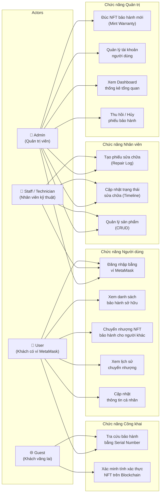
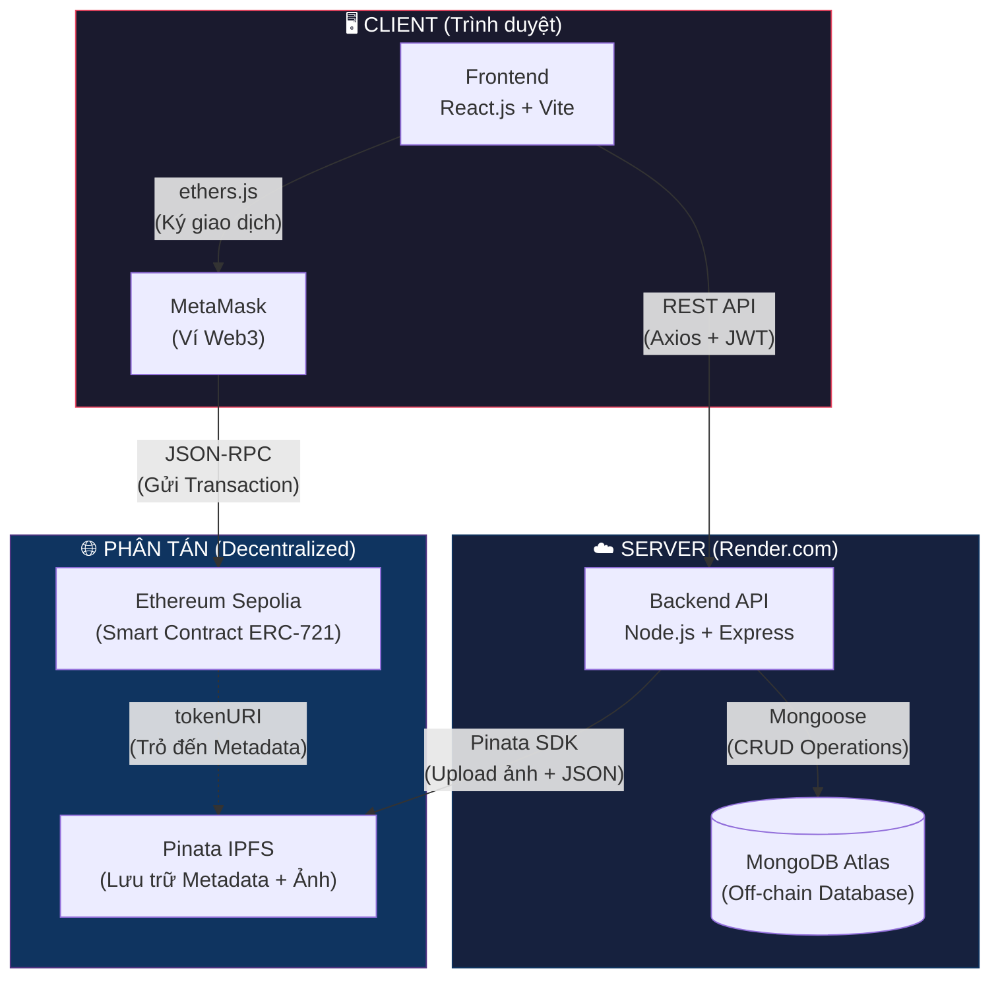
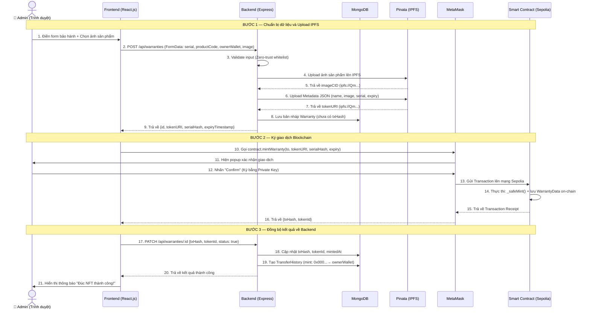
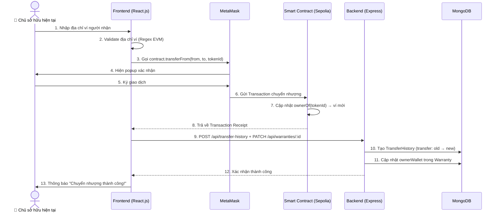
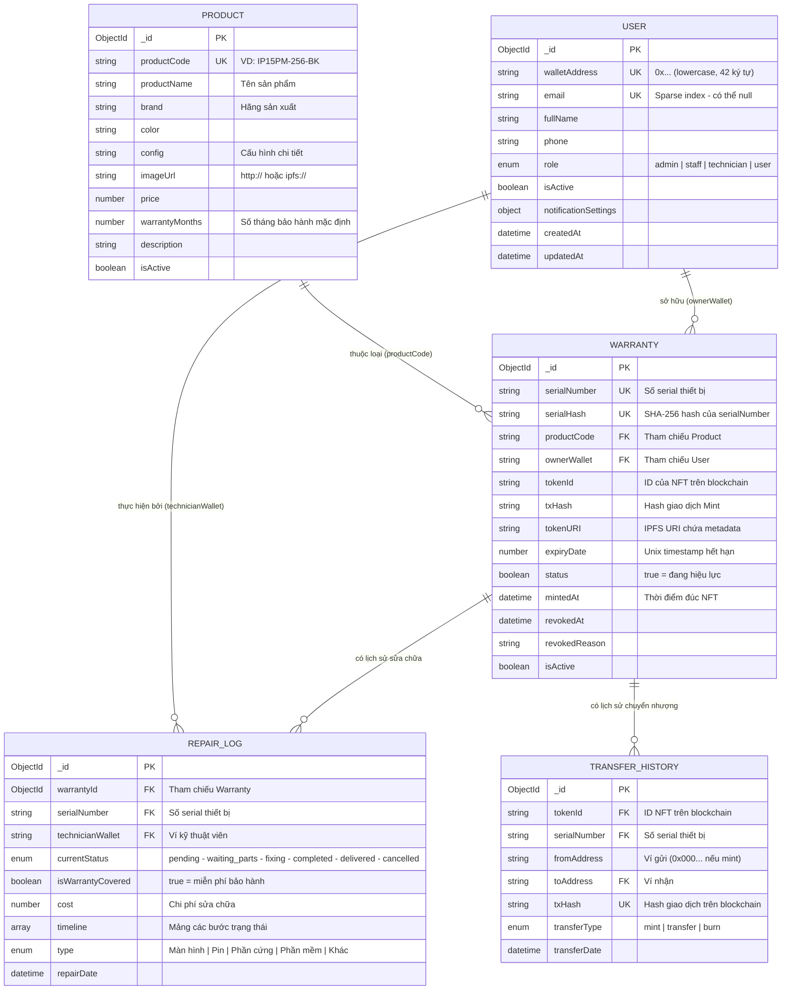
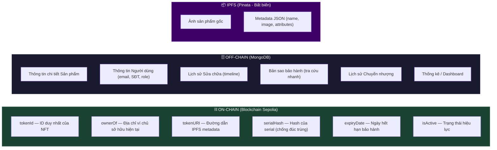
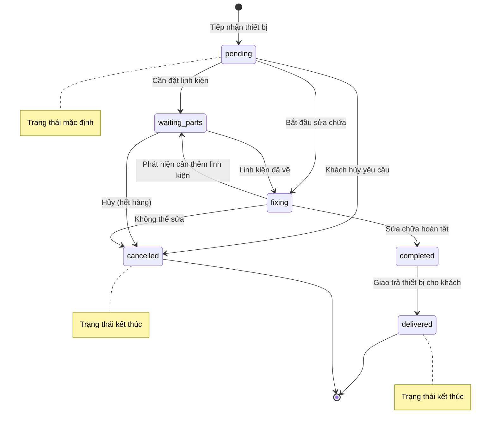

# 🏗️ Tài Liệu Kiến Trúc Hệ Thống E-Warranty

> **Mô tả**: Tài liệu này trình bày toàn diện kiến trúc của hệ thống Bảo Hành Điện Tử (E-Warranty) theo mô hình **Hybrid Web3**, bao gồm các sơ đồ Use Case, Sequence, ERD và Component Architecture.

---

## 📑 Mục lục
1. [Sơ đồ Use Case](#1-sơ-đồ-use-case)
2. [Sơ đồ Kiến trúc Hệ thống](#2-sơ-đồ-kiến-trúc-hệ-thống-component-architecture)
3. [Sơ đồ Tuần tự — Luồng Đúc NFT Bảo Hành](#3-sơ-đồ-tuần-tự--luồng-đúc-nft-bảo-hành-mint-warranty)
4. [Sơ đồ Tuần tự — Luồng Chuyển Nhượng NFT](#4-sơ-đồ-tuần-tự--luồng-chuyển-nhượng-nft-transfer)
5. [Sơ đồ Cơ sở Dữ liệu Off-chain (ERD)](#5-sơ-đồ-cơ-sở-dữ-liệu-off-chain-erd)
6. [Phân tách Dữ liệu On-chain vs Off-chain](#6-phân-tách-dữ-liệu-on-chain-vs-off-chain)
7. [Sơ đồ Trạng thái Sửa chữa](#7-sơ-đồ-trạng-thái-sửa-chữa-repair-state-machine)

---

## 1. Sơ đồ Use Case

Hệ thống E-Warranty phân chia người dùng thành **4 vai trò (Role)** chính, mỗi vai trò có tập hợp chức năng riêng biệt:

### Giải thích vai trò:

| Vai trò | Xác thực | Mô tả |
|---------|----------|-------|
| **Guest** | Không cần | Bất kỳ ai truy cập web đều có thể tra cứu và xác minh bảo hành. |
| **User** | MetaMask + JWT | Khách hàng đã kết nối ví. Sở hữu NFT bảo hành và có quyền chuyển nhượng. |
| **Staff / Technician** | MetaMask + JWT (role: staff) | Nhân viên kỹ thuật. Tiếp nhận thiết bị, ghi nhận tiến trình sửa chữa. |
| **Admin** | MetaMask + JWT (role: admin) | Chủ cửa hàng / người triển khai Smart Contract. Có toàn quyền quản trị và đúc NFT. |

---

## 2. Sơ đồ Kiến trúc Hệ thống (Component Architecture)

Sơ đồ dưới đây mô tả cách **5 thành phần cốt lõi** của hệ thống kết nối và giao tiếp với nhau:

### Vai trò của từng thành phần:

| Thành phần | Công nghệ | Vai trò |
|------------|-----------|---------|
| **Frontend** | React.js, Vite, SWR, ethers.js | Giao diện người dùng. Gửi dữ liệu lên Backend, điều phối MetaMask ký giao dịch. |
| **Backend** | Node.js, Express, Mongoose, Multer | Xử lý nghiệp vụ. Xác thực JWT, upload IPFS, quản lý CSDL. Bảo vệ toàn bộ Secret Key. |
| **MongoDB Atlas** | MongoDB (Cloud) | Lưu trữ dữ liệu Off-chain: Sản phẩm, Người dùng, Lịch sử sửa chữa, Bản sao bảo hành. |
| **Pinata IPFS** | IPFS Protocol | Lưu trữ phi tập trung: Ảnh sản phẩm và Metadata JSON cho NFT. Dữ liệu bất biến. |
| **Smart Contract** | Solidity (ERC-721), Sepolia | Đảm bảo quyền sở hữu bảo hành trên Blockchain. Chống giả mạo, cho phép chuyển nhượng. |

---

## 3. Sơ đồ Tuần tự — Luồng Đúc NFT Bảo Hành (Mint Warranty)

Đây là luồng cốt lõi của hệ thống, mô tả chi tiết **12 bước** từ lúc Admin điền form đến khi NFT được đúc thành công:

### Xử lý lỗi trong luồng Mint:
- **Bước 12 — Admin bấm "Reject"**: MetaMask ném lỗi `code: 4001`. Frontend bắt lỗi, hiển thị thông báo thân thiện. Bản nháp DB vẫn được giữ lại để Admin thử lại mà không cần tạo mới.
- **Bước 13 — Giao dịch thất bại trên chain**: Frontend hiển thị lỗi RPC. Bản nháp DB không bị xóa, Admin có thể retry.

---

## 4. Sơ đồ Tuần tự — Luồng Chuyển Nhượng NFT (Transfer)

Khi khách hàng muốn chuyển phiếu bảo hành cho người khác (ví dụ: bán lại thiết bị cũ):

---

## 5. Sơ đồ Cơ sở Dữ liệu Off-chain (ERD)

Hệ thống sử dụng **MongoDB** (NoSQL) với 5 Collection chính. Dưới đây là sơ đồ quan hệ logic giữa các Collection:

---

## 6. Phân tách Dữ liệu On-chain vs Off-chain

Đây là điểm mấu chốt của kiến trúc **Hybrid Web3** — biết đặt dữ liệu đúng chỗ để vừa đảm bảo tính bất biến, vừa tối ưu chi phí gas:

### Tại sao phân tách như vậy?

| Tiêu chí | On-chain (Blockchain) | Off-chain (MongoDB) | IPFS |
|----------|----------------------|---------------------|------|
| **Chi phí** | Rất cao (tốn Gas mỗi lần ghi) | Gần như miễn phí | Miễn phí (Pinata Free tier) |
| **Tốc độ** | Chậm (15-30 giây/block) | Rất nhanh (< 100ms) | Nhanh khi đọc |
| **Tính bất biến** | ✅ Tuyệt đối (không ai sửa được) | ❌ Có thể sửa/xóa | ✅ Bất biến (CID-based) |
| **Dữ liệu phù hợp** | Quyền sở hữu, chống giả mạo | Nghiệp vụ thay đổi thường xuyên | File lớn (ảnh, JSON) |

### Nguyên tắc thiết kế:
- **Dữ liệu cần chống giả mạo** (quyền sở hữu, tính xác thực) → **On-chain**.
- **Dữ liệu cần truy vấn nhanh và thay đổi thường xuyên** (sửa chữa, thống kê, thông tin cá nhân) → **Off-chain (MongoDB)**.
- **File nhị phân và metadata cần tồn tại vĩnh viễn** (ảnh sản phẩm, JSON metadata) → **IPFS**.
- **Đồng bộ hóa**: Backend luôn giữ một bản sao (mirror) của dữ liệu on-chain (txHash, tokenId, ownerWallet) trong MongoDB để phục vụ truy vấn tức thì mà không cần gọi Blockchain.

---

## 7. Sơ đồ Trạng thái Sửa chữa (Repair State Machine)

Mỗi phiếu sửa chữa (Repair Log) trong hệ thống tuân theo một quy trình chuyển trạng thái nghiêm ngặt, tương tự như ứng dụng theo dõi giao hàng:

### Mô tả trạng thái:

| Trạng thái | Tiếng Việt | Mô tả |
|-----------|-----------|-------|
| `pending` | Tiếp nhận | Thiết bị vừa được tiếp nhận tại cửa hàng |
| `waiting_parts` | Chờ linh kiện | Cần đặt mua linh kiện thay thế |
| `fixing` | Đang sửa | Kỹ thuật viên đang tiến hành sửa chữa |
| `completed` | Hoàn tất | Sửa chữa xong, chờ khách đến nhận |
| `delivered` | Đã giao | Đã trả thiết bị cho khách hàng ✅ |
| `cancelled` | Đã hủy | Phiếu sửa chữa bị hủy bỏ ❌ |
